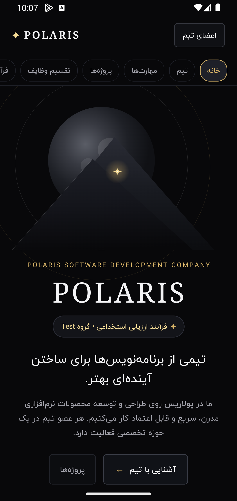
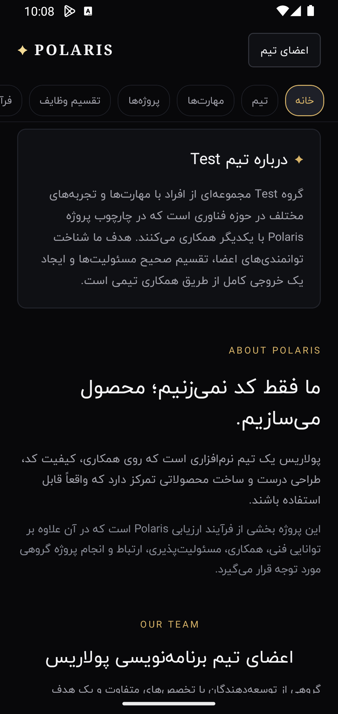
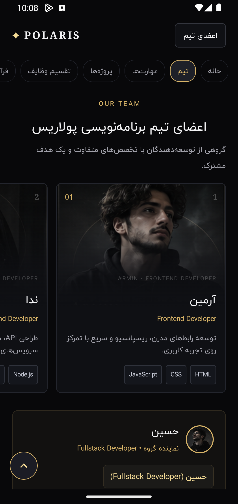
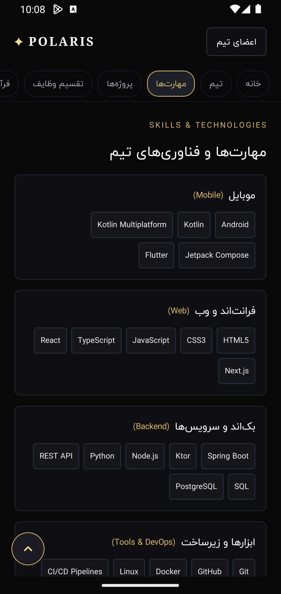
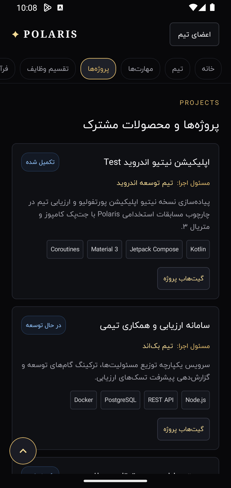
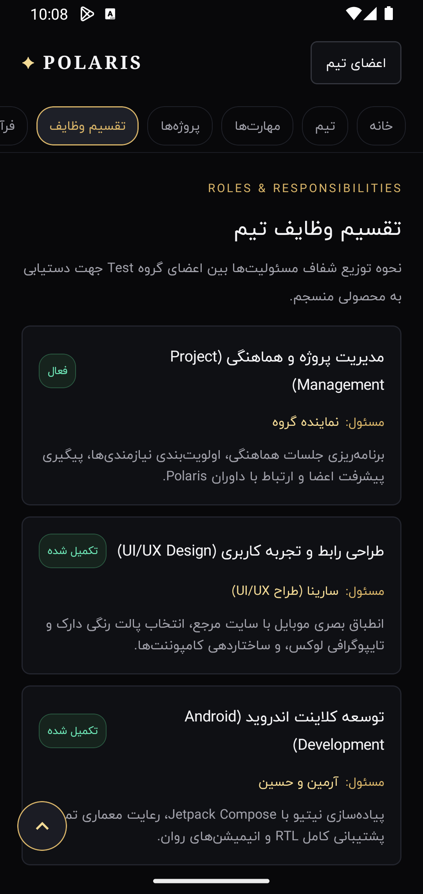
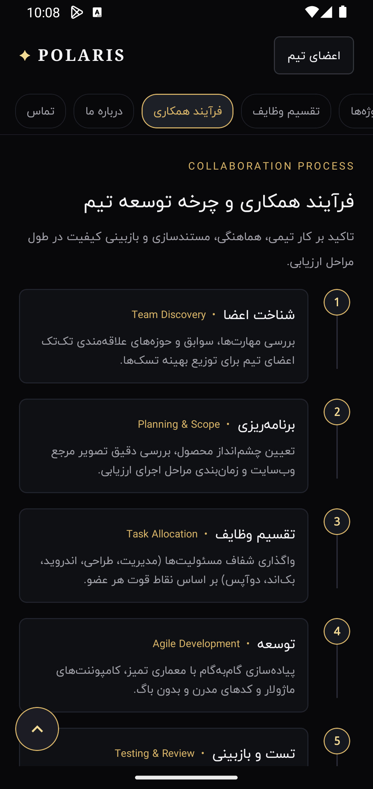
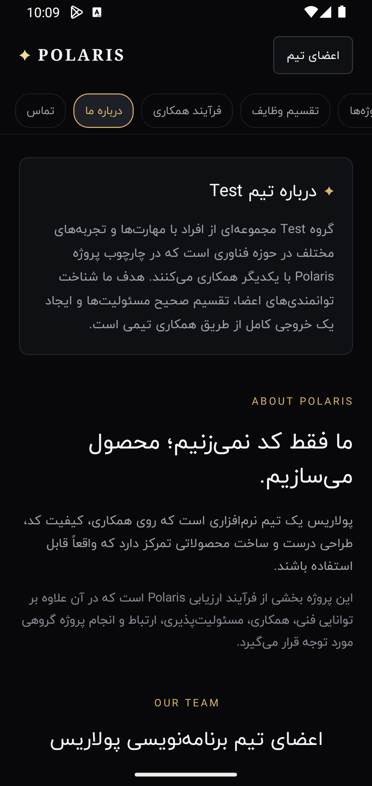
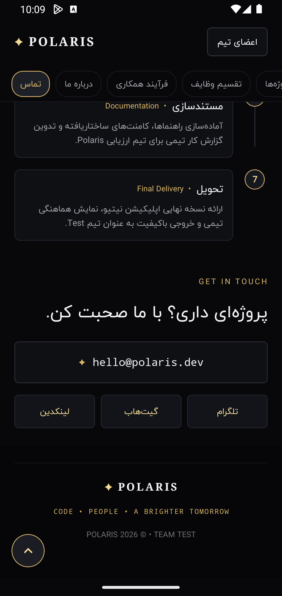

# Polaris Team Portfolio — اپلیکیشن معرفی تیم پولاریس

# POLARIS SOFTWARE DEVELOPMENT COMPANY
### *تیمی از برنامه‌نویس‌ها برای ساختن آینده‌ای بهتر*

[](https://developer.android.com)
[](https://kotlinlang.org)
[](https://developer.android.com/jetpack/compose)
[](https://android-arsenal.com/api?level=24)
[](https://android-arsenal.com/api?level=36)
[](https://fontiran.com)
[](https://s33.uupload.ir/files/mshajkarami/Polaris_Test/polaris.apk)

<br/>

<a href="https://s33.uupload.ir/files/mshajkarami/Polaris_Test/polaris.apk">
  
</a>

</div>

> [!TIP]
> 📥 **دانلود مستقیم نسخه آماده (APK):** جهت تست و اجرای مستقیم اپلیکیشن بر روی دستگاه یا شبیه‌ساز، می‌توانید فایل APK را مستقیماً از لینک روبرو دریافت نمایید:  
> 👉 **[دانلود مستقیم اپلیکیشن polaris.apk](https://s33.uupload.ir/files/mshajkarami/Polaris_Test/polaris.apk)**

---

## 📱 پیش‌نمایش محیط اپلیکیشن (UI Screenshots Preview)

<div align="center">

<table>
  <tr>
    <td align="center" width="33%">
      
      <br />
      <b>۰۱. هیرو و آرت نجومی</b>
      <br />
      <sub>Celestial Hero & Canvas Art</sub>
    </td>
    <td align="center" width="33%">
      
      <br />
      <b>۰۲. درباره تیم و پولاریس</b>
      <br />
      <sub>About Team & Polaris Mission</sub>
    </td>
    <td align="center" width="33%">
      
      <br />
      <b>۰۳. اعضای تیم و نماینده</b>
      <br />
      <sub>Team Members & Representative</sub>
    </td>
  </tr>
  <tr>
    <td align="center" width="33%">
      
      <br />
      <b>۰۴. مهارت‌ها و فناوری‌ها</b>
      <br />
      <sub>Categorized Tech Stack</sub>
    </td>
    <td align="center" width="33%">
      
      <br />
      <b>۰۵. پروژه‌ها و محصولات</b>
      <br />
      <sub>Project Cards & Status</sub>
    </td>
    <td align="center" width="33%">
      
      <br />
      <b>۰۶. تقسیم وظایف شفاف</b>
      <br />
      <sub>Roles & Responsibilities Matrix</sub>
    </td>
  </tr>
  <tr>
    <td align="center" width="33%">
      
      <br />
      <b>۰۷. فرآیند همکاری و چرخه توسعه</b>
      <br />
      <sub>7-Step Collaboration Lifecycle</sub>
    </td>
    <td align="center" width="33%">
      
      <br />
      <b>۰۸. چشم‌انداز و بیانیه پولاریس</b>
      <br />
      <sub>Vision & Core Values</sub>
    </td>
    <td align="center" width="33%">
      
      <br />
      <b>۰۹. بخش ارتباط و فوتر</b>
      <br />
      <sub>Contact, Socials & Footer</sub>
    </td>
  </tr>
</table>

</div>

---

## 🌟 درباره پروژه (About the Project)

اپلیکیشن **Polaris Team Portfolio** یک نمونه پروژه نیتیو و مدرن اندروید است که با استفاده از **Jetpack Compose** و معماری مدرن **Material 3** توسعه یافته است. این برنامه به منظور معرفی تیم توسعه نرم‌افزار پولاریس (گروه Test)، تخصص‌ها، مسئولیت‌ها، پروژه‌ها و سازوکار همکاری تیمی طراحی شده است.

### ویژگی‌های طراحی و فنی:
- **🔤 فونت ایران‌یکان (Iran Yekan):** اعمال تایپوگرافی اصیل و وزن‌های مختلف (Light، Regular، Medium، Bold) در سراسر متون، کارت‌ها و دیالوگ‌ها.
- **🌌 تم کهکشانی دارک (Celestial Dark Theme):** پالت رنگی مشکی عمیق با های‌لایت‌های طلایی پولاریس (`PolarisGold` و `PolarisGoldBright`).
- **🎨 آرت ژئومتریک اختصاصی در Canvas:** پیاده‌سازی بومی ماه، مدارهای نجومی، رشته‌کوه‌ها و ستاره قطبی در Jetpack Compose Canvas.
- **🔄 چینش راست‌به‌چپ (Full RTL):** ساختار استاندارد فارسی با ناوبری و تب‌های دسترسی سریع به بخش‌های مختلف صفحه.

---

## 👥 اعضای تیم توسعه (Team Members)

| شماره | نام | نقش تخصصی | مهارت‌ها و فناوری‌ها |
| :---: | :---: | :--- | :--- |
| **01** | **آرمین** | `Frontend Developer` | `HTML`, `CSS`, `JavaScript`, `Responsive Design` |
| **02** | **ندا** | `Backend Developer` | `Node.js`, `Python`, `API`, `Microservices` |
| **03** | **حسین** | `Fullstack Developer` *(نماینده تیم)* | `React`, `Node.js`, `SQL`, `Clean Architecture` |
| **04** | **سارینا** | `UI/UX & Frontend` | `Figma`, `UI`, `React`, `Design Systems` |
| **05** | **علی** | `DevOps & Infrastructure` | `Linux`, `Docker`, `CI/CD`, `Cloud Architecture` |

---

## 🧩 بخش‌های اصلی اپلیکیشن (Core Sections)

1. **هدر و برند پولاریس (`PolarisHeader`):** نشان رسمی پولاریس، تب‌های ناوبری سریع، و دکمه اعضای تیم.
2. **هیرو (`PolarisHero`):** انیمیشن آرت ماه و کوهستان، عنوان و معرفی ماموریت شرکت، دکمه‌های اقدام اولیه.
3. **درباره ما (`PolarisAboutSection`):** بیانیه گروه Test، اهداف و فلسفه ساخت محصول به جای صرفاً کدنویسی.
4. **کارت‌های اعضای تیم (`MemberCard`):** تصاویر پرتره اختصاصی، گرادیان تلفیق‌شده با پس‌زمینه، تگ‌های تخصصی و نشان نماینده.
5. **دیالوگ مشخصات تفصیلی (`MemberDetailDialog`):** مودال جامع شامل تصویر بزرگ، پروژه‌ها، مهارت‌ها و کانال‌های ارتباطی (GitHub, LinkedIn, Telegram).
6. **کارت نماینده تیم (`TeamRepresentativeCard`):** آواتار دایره‌ای با قاب طلایی، نقش و توضیحات مسئول هماهنگی.
7. **دسته‌بندی مهارت‌ها (`SkillSection`):** ۴ دسته‌بندی متمایز شامل موبایل، وب، بک‌اند، ابزارها و DevOps.
8. **پروژه‌ها و وضعیت (`ProjectCard`):** معرفی پروژه‌های کلیدی به همراه وضعیت، مسئول پروژه و قابلیت کپی/اشتراک‌گذاری.
9. **تقسیم وظایف (`ResponsibilityCard`):** شفاف‌سازی نقش‌های هماهنگی، طراحی UI/UX، توسعه فرانت و بک‌اند، و زیرساخت.
10. **تایم‌لاین ۷ مرحله‌ای (`CollaborationTimeline`):** مراحل گام‌به‌گام از شناخت اعضا تا بازبینی، مستندسازی و تحویل نهایی.
11. **تماس و فوتر (`PolarisContactSection` & `PolarisFooter`):** دکمه ارتباطی ایمیل، شبکه‌های اجتماعی و کپی‌رایت اختصاصی.

---

## 📁 ساختار پوشه‌های پروژه (Directory Structure)

```text
├── UI_Screen/                      # اسکرین‌شات‌های محیط کاربری برای گیت‌هاب
│   ├── 01_hero_section.png
│   ├── 02_about_section.png
│   ├── 03_team_members.png
│   ├── 04_skills_technologies.png
│   ├── 05_projects.png
│   ├── 06_roles_responsibilities.png
│   ├── 07_collaboration_timeline.png
│   ├── 08_polaris_vision.png
│   └── 09_contact_footer.png
├── app/
│   ├── src/main/
│   │   ├── java/ir/polaris/test/
│   │   │   ├── MainActivity.kt
│   │   │   ├── data/TeamData.kt
│   │   │   ├── model/
│   │   │   │   ├── Project.kt
│   │   │   │   ├── Responsibility.kt
│   │   │   │   ├── SkillAndCollaboration.kt
│   │   │   │   └── TeamMember.kt
│   │   │   ├── ui/
│   │   │   │   ├── components/
│   │   │   │   ├── screens/MainPortfolioScreen.kt
│   │   │   │   └── theme/
│   │   │   │       ├── Color.kt
│   │   │   │       ├── Theme.kt
│   │   │   │       └── Type.kt (Iran Yekan)
│   │   └── res/
│   │       ├── drawable/ (member1.png ... member5.png)
│   │       └── font/ (iran_yekan_regular.ttf, iran_yekan_l.ttf)
│   └── src/test/java/ir/polaris/test/PolarisAppTest.kt
├── build.gradle.kts
└── settings.gradle.kts
```

---

## 📥 دانلود مستقیم فایل نصبی (Download APK)

جهت نصب و اجرای فوری اپلیکیشن بدون نیاز به کامپایل یا بیلد سورس‌کد، فایل نصبی نهایی را مستقیماً دانلود نمایید:

<div align="center">

[](https://s33.uupload.ir/files/mshajkarami/Polaris_Test/polaris.apk)

**لینک مستقیم:**  
[`https://s33.uupload.ir/files/mshajkarami/Polaris_Test/polaris.apk`](https://s33.uupload.ir/files/mshajkarami/Polaris_Test/polaris.apk)

</div>

---

## 🚀 نحوه بیلد و راه‌اندازی (Build & Run)

### پیش‌نیازها:
- **Android Studio** (نسخه Ladybug / Meerkat یا جدیدتر)
- **JDK 17** یا بالاتر
- دستگاه اندروید یا ایمولاتور با **Android 7.0+ (API 24)**

### دستورات خط فرمان:

```bash
# اجرای کلیه تست‌های واحد
./gradlew testDebugUnitTest

# بیلد نسخه نهایی دیباگ
./gradlew assembleDebug
```

فایل خروجی APK پس از بیلد:
```text
app/build/outputs/apk/debug/app-debug.apk
```

---

## 📄 لایسنس و حقوق اثر (License)

© 2026 **POLARIS** • All Rights Reserved.  
*CODE • PEOPLE • A BRIGHTER TOMORROW*
